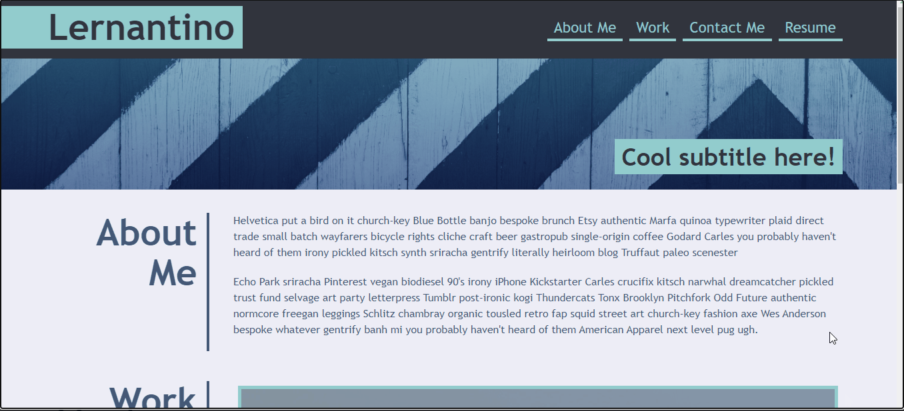
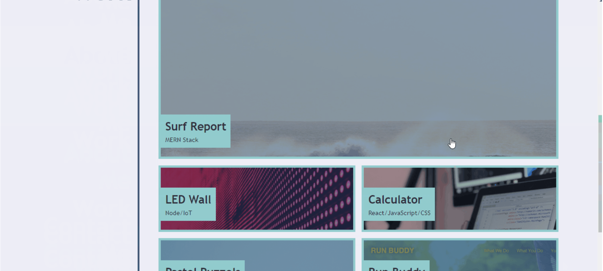
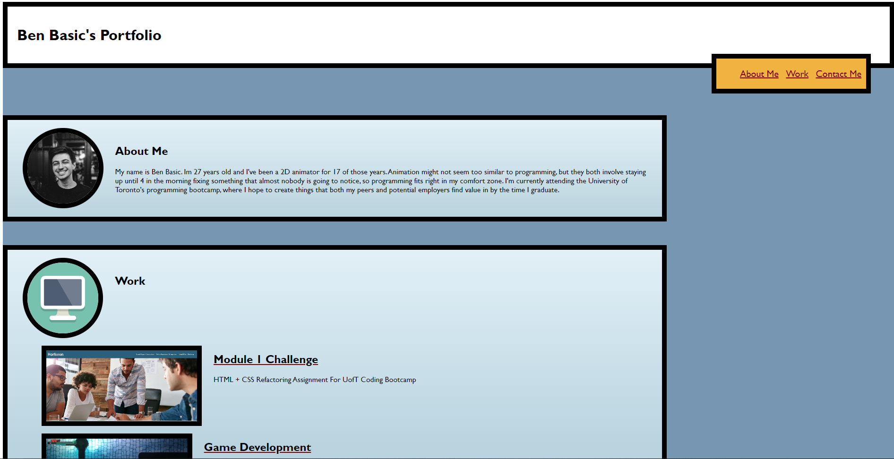
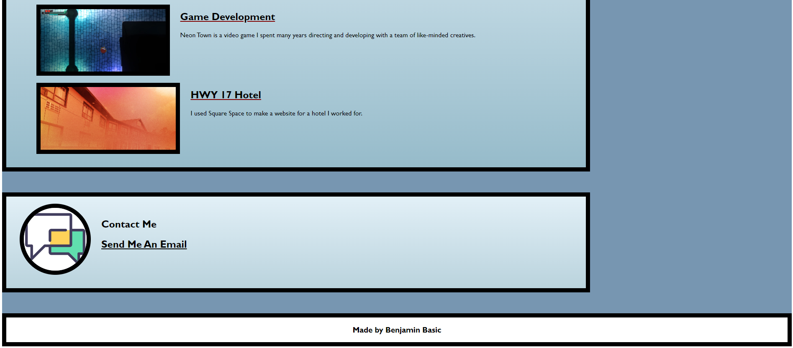

# Portfolio

This repository is my second challenge of many to complete within the UofT coding bootcamp I'm taking part of. 
The assignment is to create a professional portfolio for prospectic employers and to meet the assignment's Acceptance Criteria.

## User Story

AS AN employer
I WANT to view a potential employee's deployed portfolio of work samples
SO THAT I can review samples of their work and assess whether they're a good candidate for an open position

## Acceptance Criteria

The Acceptance Criteria is as follows:

GIVEN I need to sample a potential employee's previous work
WHEN I load their portfolio
THEN I am presented with the developer's name, a recent photo or avatar, and links to sections about them, their work, and how to contact them
WHEN I click one of the links in the navigation
THEN the UI scrolls to the corresponding section
WHEN I click on the link to the section about their work
THEN the UI scrolls to a section with titled images of the developer's applications
WHEN I am presented with the developer's first application
THEN that application's image should be larger in size than the others
WHEN I click on the images of the applications
THEN I am taken to that deployed application
WHEN I resize the page or view the site on various screens and devices
THEN I am presented with a responsive layout that adapts to my viewport

## The Goal

The goal of this assignment is to make a portfolio similar in functionality to something like this:

And in the end I got this as a result:

## Link To Deployed Application
https://benbasic.github.io/Portfolio/

